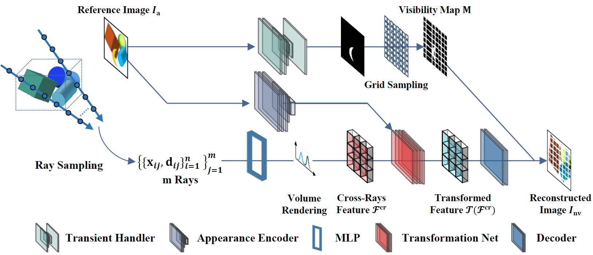

<!DOCTYPE html>
<html lang="en">
  <head>
    <meta charset="UTF-8">
    <meta http-equiv="X-UA-Compatible" content="IE=edge">
    <meta name="viewport" content="width=device-width, initial-scale=1">
    <!-- Bootstrap -->
    <link rel="stylesheet" href="https://stackpath.bootstrapcdn.com/bootstrap/4.3.1/css/bootstrap.min.css" integrity="sha384-ggOyR0iXCbMQv3Xipma34MD+dH/1fQ784/j6cY/iJTQUOhcWr7x9JvoRxT2MZw1T" crossorigin="anonymous">
  </head>

  <!-- cover -->
  <section>
    

      

        

          

            <h2> Cross-Ray Neural Radiance Fields for Novel-View Synthesis from Unconstrained Photo Collections</h2>
            <!-- <h4 style="color:#5a6268;">ICML 2023</h4> -->
            <!-- 

            <h6> <a href="" target="_blank">A</a>1, 
                <a href="" target="_blank">B</a>2,
                <a href="" target="_blank">C</a>2, 
                <a href="" target="_blank">D</a>1,
                </a>2,
                <a href="" target="_blank">F</a>2, 
                <a href="" target="_blank">G</a>2</h6>
            
1A &nbsp;&nbsp; 
                2B

            

              

                  
<a class="btn btn-large btn-dark" href="baidu.com" role="button"  target="_blank">
                    <ion-icon name="document-text-outline"></ion-icon> Paper</a> 

              

              &nbsp;&nbsp;
              

                  
<a class="btn btn-large btn-dark" href="" role="button"  target="_blank">
                    <ion-icon name="logo-github"></ion-icon> Code</a> 

              

              &nbsp;&nbsp;
              

                  
<a class="btn btn-large btn-dark" href="" role="button"  target="_blank">
                    <ion-icon name="document-attach-outline"></ion-icon> Supplementary</a> 

              

              &nbsp;&nbsp;
              

                
<a class="btn btn-large btn-dark" href="" role="button"  target="_blank">
                  <ion-icon name="document-text-outline"></ion-icon>Poster</a> 
 -->
            

            

          

        

      

    

  </section>

  <!-- abstract -->
  <!-- <section>
    

      

        

          <h3>Abstract</h3>
            

            
          
Neural Radiance Fields (NeRF) has shown remarkable capabilities in novel view synthesis from static scene images and has facilitated significant advances in virtual reality and digital humans. This paper focuses on the problem of recovering a NeRF which is unobstructed by transient objects and controllable in appearance from challenging unconstrained photo collections, where 1) the images may have dynamic change over appearance due to different capturing time and camera settings, and 2) the images may be occluded by transient objects such as humans and cars. Conventional approaches seek to address this task by locally utilizing each single ray (i.e., a light cast from a camera through a pixel on an image plane into a 3D scene) to synthesize a color of pixel  independently. Here, our observation is that human tends to leverage global information to recognize appearance and objects. We theoretically find that leveraging correlation across multiple rays promotes capturing more global information.  Motivated by this, we propose a Cross-Ray NeRF (CR-NeRF) to synthesize non-occlusion images with a desired appearance from unconstrained images. Specifically, to model varying appearances, we first propose to represent multiple rays with a novel cross-ray feature and then recover the appearance by fusing global statistics, i.e., feature covariance of the rays and image appearance. Moreover, to avoid occlusion introduced by transient objects, we propose a transient objects handler and introduce a grid sampling strategy for masking out the transient objects. Extensive experimental results on large real-world datasets verify the effectiveness of CR-NeRF.

        

      

    

  </section>
    -->

  <section>
    

      

        

            <h3>Appearance Hallucination</h3>
            

            <h4 style="margin-top:20px; margin-bottom:20px; color:#717980">Brandenburg Gate</h4>
            <video width="100%" playsinline="" autoplay="autoplay" loop="loop" preload="" muted="">
                <source src="https://github.com/AnderDong/CR-NeRF_test/blob/main/video/video1.mp4">
            </video>
            <h4 style="margin-top:20px; margin-bottom:20px; color:#717980">Trevi Fountain</h4>
            <video width="100%" playsinline="" autoplay="autoplay" loop="loop" preload="" muted="">
                <source src="https://github.com/AnderDong/CR-NeRF_test/blob/main/video/video2.mp4">
            </video>
            </video>
        

      

    

  </section>
   

  <!-- Cross-Appearance Hallucination -->
  <section>
    

      

        

            <h3>Cross-Appearance Hallucination</h3>
            

            <h4 style="margin-top:20px; margin-bottom:20px; color:#717980">From Trevi Fountain to Brandenburg Gate</h4>
            <video width="100%" playsinline="" autoplay="autoplay" loop="loop" preload="" muted="">
                <source src="https://github.com/AnderDong/CR-NeRF_test/blob/main/video/video3.mp4">
            </video>
            <h4 style="margin-top:20px; margin-bottom:20px; color:#717980">From Brandenburg Gate to Trevi Fountain</h4>
            <video width="100%" playsinline="" autoplay="autoplay" loop="loop" preload="" muted="">
                <source src="https://github.com/AnderDong/CR-NeRF_test/blob/main/video/video4.mp4">
            </video>
            </video>
        

      

    

  </section>
   

  <!-- Appearance Hallucination From Artworks -->
  <section>
    

      

        

            <h3>Appearance Hallucination From Artworks</h3>
            

            <video width="100%" playsinline="" autoplay="autoplay" loop="loop" preload="" muted="">
                <source src="https://github.com/AnderDong/CR-NeRF_test/blob/main/video/video5.mp4">
            </video>
        

      

    

  </section>

  <!-- citing -->
  <!-- 

    

      

          <h3>Citation</h3>
          

              <pre style="background-color: #e9eeef;padding: 1.25em 1.5em">
<code>@inproceedings{
}</code> -->

</pre>
          <!-- 

      

    

  
 -->
<!-- 
  
   -->

</body>
</html>
